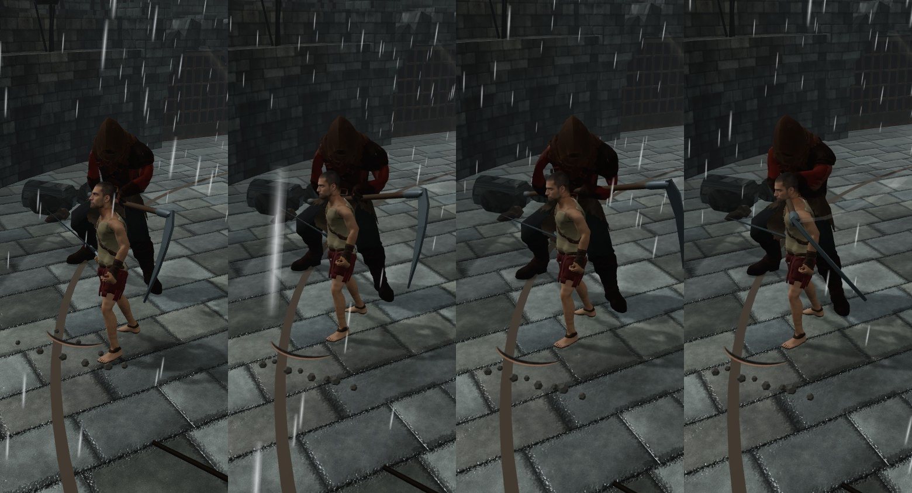
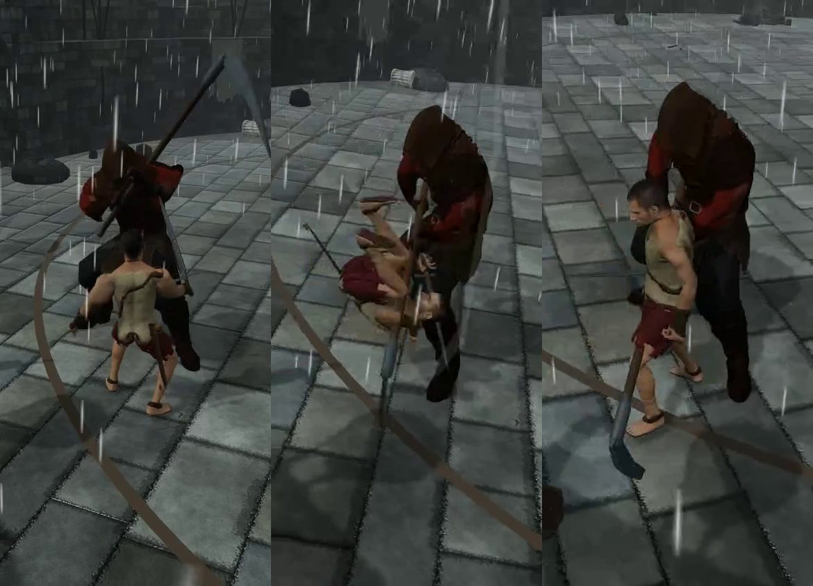

# Player-experience pilot — 5 October 2026

The five-part pilot is complete. The strongest design finding is **close-range body overlap can hide a weapon tell**. Two bot defects also emerged: the observation proxy misses the actual enemy-charge sound onset, and the recovery policy can wait for stamina above the wounded fighter's ceiling. Neither justifies changing game damage, reach or difficulty.

This is a frozen local game study at `4056467af826b03166a575002f7a4f4b04f9dfe7`, not live-site acceptance. Normal launcher, policy, profiles and observation code remain unchanged. Bot Dev owns engineering; Bot Combat operated the nine fights and independently checked receipts/sampled footage. Source review was performed by Bot Dev, not a separate code reviewer.

## Evidence

- **27 direct-engine fights:** three profiles × Goblin/Veteran/Executioner × three matched seeds. Longsword, engine L6, no equipped specials, workarounds off. Actual engine fights, not statistical predictions. No rendering/input-device acceptance.
- **Nine actual browser fights:** same roster/profiles and starting seed `2026100507`, real keyboard input and rendered full Chromium on Apple M5 Metal. Controlled time, 390×844, full silent videos. Input timing differs from the engine runner, so results are not interchangeable.
- **Six masked pre-contact visual sequences:** predictions saved before opening the event answers. Four chronological stills per reviewed sequence; game knowledge/curated selection remain prior information. Five type-and-direction answers correct; one explicitly unclear. Not a human readability rate or a real-time vision player.
- **Three fresh native-time AV replays:** actual game WebAudio output and canvas in one MediaRecorder; decoded sprite warmed before the fight; speakers silent. Raw event dispatches and verified final state match the retained engine-authored inputs. Actual camera pose and render/audio/performance timestamps recorded. These are rendered replays, not new policy fights. Approximate native render rates 59–60 FPS; encoded/captured FPS is a separate measure.
- **20 trusted browser-touch probes:** draw, slash/stab/kick/pommel hits, charged hold, five guard directions, tap step, held/moving rolls, drag-off feint, cancellation, simultaneous movement/guard, actual Veteran parry and block. All accepted-effect and release/UI-clear checks pass. Includes draw twice. Dummy coverage is not a competence fight; charging did not establish a heavy hit. Physical-phone comfort, latency and class-special coverage remain open.
- **97 bot tests pass on VPS**, no failures/skips. All nine full videos and three final AV exports decode; source/media hashes retained. Native AV is converted to normal-speed H.264/AAC MP4 for reliable seeking. No fabricated sound, music or time scaling.

Raw local receipts: `/Users/domininclynch/Developer/frankendom-test-bot-launcher-20261005/artifacts/combat/player-senses-20261005/`. Failed startup/capture/contact probes are retained. [Machine-readable evidence](evidence/player-senses-20261005.json) includes exact attack counts, profiles, cue audit, touch effects and prediction hash.

| Profile | Engine wins: Goblin / Veteran / Executioner | Browser: Goblin / Veteran / Executioner |
| --- | --- | --- |
| Beginner | 1/3 · 1/3 · 2/3 | loss · win · win |
| Intermediate | 0/3 · 2/3 · 3/3 | win · win · win |
| Advanced | 2/3 · 3/3 · 3/3 | timeout · win · win |

Browser totals: seven wins, one loss, one timeout. Heavy counts/start counts: beginner **0/14, 1/23, 0/25**; intermediate **0/17, 1/19, 0/13**; advanced **0/14, 1/14, 0/11**. Every fight stays below 20%; max 7.1%. No attack padding. All 27 engine fights pass their cap too. These are small synthetic samples, not population win rates or a new full-roster acceptance. Existing broader acceptance applies only to its retained seeds.

## Ten useful learnings and proposals

1. **Protect the opponent's attacking silhouette.** Blind scene 5, Executioner ticks 891–920: a right slash was unreadable to this reviewer behind the hero at close range. The operator independently saw close-overlap problems in current-camera clips. Ask the game team to compare a small adaptive view adjustment using this exact exchange, protecting the blade without breaking camera-relative movement. Confidence: strong for this case, limited generality; do not revert the camera globally.

   

2. **Keep the readable overhead silhouette.** The three overhead sequences were identified, including Goblin's smaller knife. Shoulder/weapon lift communicates a threat. Preserve that strength when modifying the camera; verify ordinary versus charged meaning separately. No new warning banner is justified by these six samples.
3. **Teach the two dodge gestures.** In the trusted-touch probe, a stationary tap produced a 0.6 m backstep; a 200 ms hold began a backstep then promoted to a roll, travelling about 3.62 m. A moving roll travelled about 3.20 m. The button reads ROLL in the recorded UI. Explain “tap to step, hold/move to roll” in existing coaching before changing distances. These are one scripted geometry's displacements, not universal design constants.
4. **Retain purposeful roll disorientation, check reacquisition.** Executioner tick 1201: horizon tilt peaks about 6.96°, returns to level within the inspected +60-tick window; the foe remains present in the sampled roll strip. This supports a brief intentional effect, not proof of comfort. Test whether a novice can reacquire the next blade on a real phone before increasing or removing shake.

   

5. **Show what a defence earned.** Native Veteran clip: parry 1061 is followed by a 30-damage hit at 1093, 0.53 seconds later. Parry 824 is followed by 24 damage at 897, 1.22 seconds later. Teach the opening and recovery distinction using those exchanges. Sequence measurement does not prove the parry caused the later hit; nominal “avoided damage” is not a measured counterfactual.
6. **Teach misses before changing reach.** Beginner wasted 18 swings across the three browser fights; advanced recorded none yet still timed out once. Improve spacing explanation and miss feedback, then challenge it with unseen seeds. This does not establish a weapon-reach defect or advanced player fun.
7. **Explain stamina attrition.** Advanced Goblin ended at 62 HP versus 6 HP, stamina stuck at 44. Seven recorded blade wounds match the authored 8-point ceiling reductions (100→44); the bot waits below a hard-coded 50-point recovery threshold. This is a bot deadlock, not evidence the opponent is unfair. Separately test whether a player understands the shrinking ceiling; explain wounds in coaching before adding HUD elements.
8. **Keep blood restrained while testing damage recognition.** Sampled clips show small flecks/stains/ground marks, no screen-covering gore. Their scale provisionally fits the gritty palette; close bodies and dark lighting can hide contact. Test contact visibility, flinch and injury recognition before enlarging splatter. This is a sampled visual opinion, not a verdict on repetition, audio or phone feel.
9. **Repair the bot's sound assumptions before blaming game tells.** The real decoded `charge_foe` begins with enemy Charging at tick 1165 in the Executioner clip. The limited proxy drops that onset and emits an ambiguous cue on Charged instead. Its source comment also assumes both actors share one charge sound; the pinned game has an enemy-specific rising cue. Next engineering experiment should represent the actual observable sound timing/identity and loading/mute limitations, retaining a semantic-proxy label. It must not silently become pixel/sound perception or be promoted without revalidation.
10. **Detect bot stalls, not just wins.** Next bounded bot fix: account for reachable own stamina recovery or detect a sustained plateau, still respecting legal attack costs and the heavy cap. Add a regression at a 44-point ceiling, then replay the retained Goblin seed plus unseen seeds before any default promotion. Keep beginner mistakes deliberately imperfect. Do not tune game rules to rescue the bot.

## Watch and reproduce

Fresh normal-speed AV: [Executioner charge/roll](evidence/player-senses-20261005/executioner.mp4), [Goblin pressure](evidence/player-senses-20261005/goblin.mp4), [Veteran defence](evidence/player-senses-20261005/veteran.mp4). Local viewer `http://127.0.0.1:8782/` also links all nine full browser matches. Muted by default. Actual sound was captured and decoded; neither AI reviewer had a hearing tool, so sound taste/recognition and phone mix remain unassessed. Native canvas clips omit DOM HUD; full-fight WebMs retain it and have no exact event-timestamp guarantee. MP4 still seeks use native render-time anchors, subject to encoder alignment.

Bot Combat **operates**, Bot Dev **codes**. After normal pinned-game setup, engine pilot on VPS:

```sh
node scripts/profile-pilot.mjs --opponents=goblin,veteran,executioner --fights=3 --seed=2026100507 --out=NEW_ENGINE_DIRECTORY
```

Explicit browser research, one run for each `beginner`, `intermediate`, `advanced`:

```sh
./run-latest.sh --opponents=goblin,veteran,executioner --player=beginner --research --fights=1 --seed=2026100507 --sparring-url='/?spar=1&opponent=veteran&difficulty=6&weapon=longsword&skill=none&special=none&yourSpecial=none' --out=NEW_BROWSER_DIRECTORY
```

The touch/audio/blind CLIs require the existing clean pinned **loopback QA asset server**, including `/.bot-revision`; `--url` selects its address. They do not install/serve a game or operate frankendom.com. Mac Metal captures need the existing owner authorization; substantial CPU tests/media use the VPS. Each diagnostic creates a fresh output directory and refuses replacement.

```sh
node scripts/touch-review.mjs --url=http://127.0.0.1:8781 --out=NEW_TOUCH_DIRECTORY
node scripts/audio-review.mjs --url=http://127.0.0.1:8781 --fight=NO_SPECIAL_ENGINE_RECEIPT.json --to=1100 --out=NEW_AUDIO_DIRECTORY
node scripts/blind-review.mjs --engine=ENGINE_DIRECTORY --out=NEW_BLIND_DIRECTORY
# Review only cases.json and masked images; save six predictions.json entries BEFORE:
node scripts/blind-review.mjs --out=NEW_BLIND_DIRECTORY --reveal
```

Audio supports only retained ordinary no-special/non-dummy fight inputs, a chosen end tick >420 and before the fight ends. It waits for a real decoded combat sprite by holding required model fetches; native clocks run during capture. It records every combat dispatch, not just the last event visible at a rendered frame. Begin/end `tick` is the latest event dispatch; `lastDrawnTick` and each frame's practice tick locate the actual simulation window. Unexpected output graphs/software rendering are refused.

No game patch, policy promotion, deployment, new package or automation was made. Further special/weapon/level matrices, continuous vision recognition, perceptual audio judging, real-phone thumb feel and human enjoyment remain separate work.
